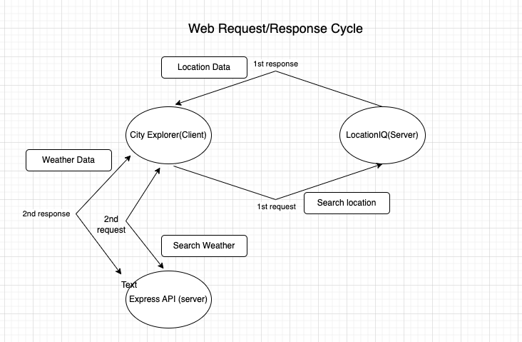

# City Explorer API

**Author**: Genevieve DuPuy
**Version**: 1.0.0

## Overview

The City Explorer app allows users to search for a city and find info regarding the searched location using data from API input.
It provides users with real-time info about locations of interest by and displaying the requested data.

## Getting Started

## Architecture

## Change Log

09-22-2023

- Initialized project

## Credit and Collaborations

- CodeFellows staff - instruction/tutoring
- Tim Heuett - mentoring/tutoring

## Time Estimates

Name of feature: Set up your server repository
Estimate of time needed to complete: 2 hrs
Start time: 2pm
Finish time: 3pm
Actual time needed to complete: 1 hr

Name of feature: Weather (placeholder): As a user of City Explorer, I want to see weather info for the city I searched, so that I know how to pack for an upcoming trip
Estimate of time needed to complete: 6 hrs
Start time: 3pm
Finish time: 9pm
Actual time needed to complete: 6hrs

Name of feature: Errors (revisited): As a user, I want clear messages if something goes wrong so I know if I need to make any changes or try again in a different manner
Estimate of time needed to complete: 1 hr
Start time: 9pm
Finish time: 9:30pm
Actual time needed to complete: 30mins
